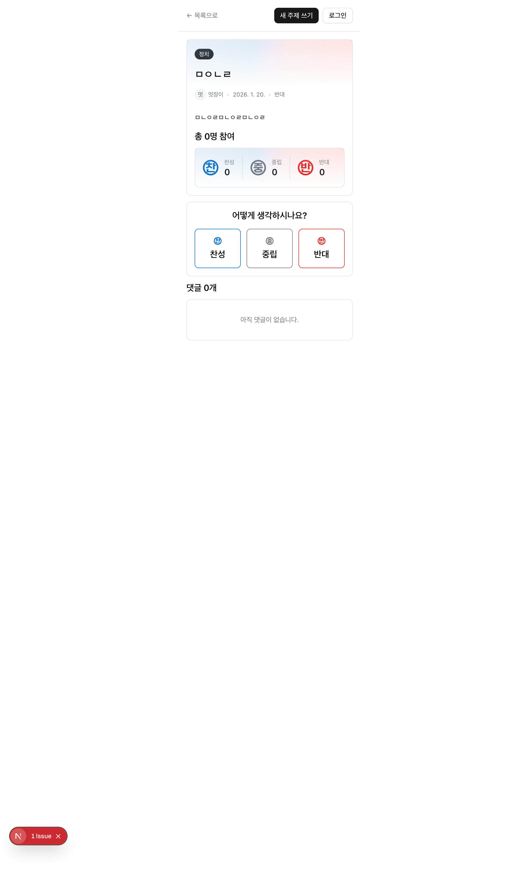
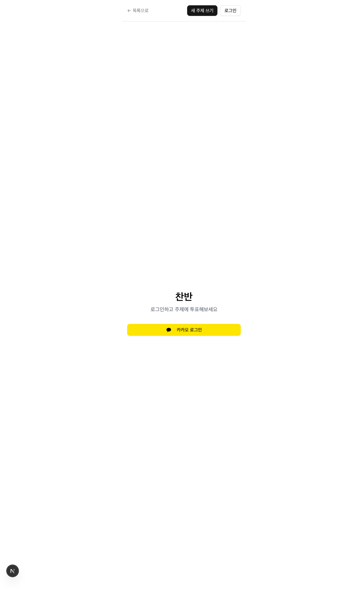
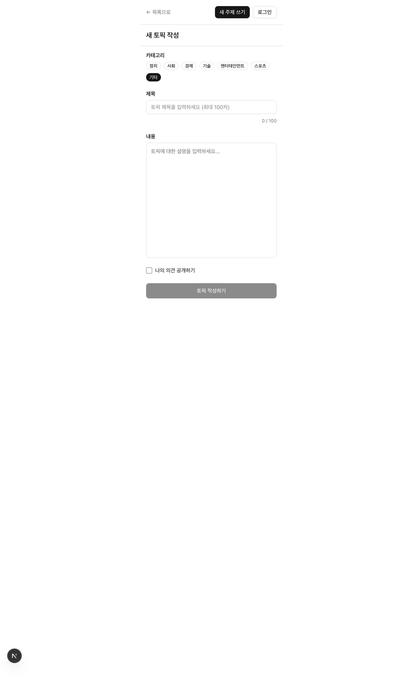

# 찬반 프로젝트 중간점검 보고서

> 작성일: 2026-01-21
> 점검 범위: 프론트엔드 70%, 백엔드 30%

---

## 1. 프로젝트 개요

### 1.1 프로젝트 소개
**찬반(Chanban)** - 주제에 대해 찬성/반대/중립 의견을 투표하고 토론하는 커뮤니티 플랫폼

### 1.2 아키텍처
```
┌─────────────────────────────────────────────────────────────┐
│                      Turborepo Monorepo                      │
├─────────────────────────────────────────────────────────────┤
│  apps/                                                       │
│  ├── web (Next.js 16 + React 19)     → Vercel 배포          │
│  └── api (NestJS 11 + TypeORM)       → Railway 배포         │
├─────────────────────────────────────────────────────────────┤
│  packages/                                                   │
│  ├── ui          (공유 UI 컴포넌트 - Radix + Tailwind)      │
│  ├── shared-types (공유 타입 + Zod 스키마)                   │
│  ├── eslint-config                                           │
│  └── typescript-config                                       │
└─────────────────────────────────────────────────────────────┘
```

### 1.3 기술 스택

#### 프론트엔드 (apps/web)
| 분류 | 기술 | 버전 |
|------|------|------|
| 프레임워크 | Next.js (Turbopack) | 16.1.3 |
| UI 라이브러리 | React | 19.2.1 |
| 상태관리 | TanStack React Query | 5.90.12 |
| UI 컴포넌트 | MUI + Radix UI | 7.x |
| 스타일링 | Tailwind CSS + Emotion | 4.x |
| 리치 텍스트 | Lexical | 0.39.0 |
| 인증 | 카카오 OAuth + JWT | - |

#### 백엔드 (apps/api)
| 분류 | 기술 | 버전 |
|------|------|------|
| 프레임워크 | NestJS | 11.0.1 |
| ORM | TypeORM | 0.3.28 |
| 데이터베이스 | PostgreSQL | - |
| 인증 | Passport + JWT | - |
| 검증 | class-validator + Zod | - |

#### 공유 패키지
- **@workspace/ui**: Radix UI 기반 공통 컴포넌트 (Button, Badge, Avatar 등)
- **@chanban/shared-types**: API 응답 타입, DTO, Enum (PostTag, VoteStatus 등)

---

## 2. 폴더 구조

### 2.1 프론트엔드 구조 (apps/web)
```
apps/web/
├── app/                          # Next.js App Router
│   ├── layout.tsx               # 루트 레이아웃
│   ├── page.tsx                 # 메인 페이지
│   ├── auth/
│   │   ├── login/page.tsx       # 로그인 페이지
│   │   ├── signup/page.tsx      # 회원가입 페이지
│   │   └── kakao/callback/      # 카카오 OAuth 콜백
│   └── topics/
│       ├── page.tsx             # 토픽 목록 (SSR + 무한스크롤)
│       ├── create/page.tsx      # 토픽 작성
│       ├── [id]/page.tsx        # 토픽 상세
│       ├── _components/         # 페이지 전용 컴포넌트
│       ├── _queries/            # React Query 훅
│       └── _constants/          # 상수 정의
├── shared/
│   ├── components/              # 공유 컴포넌트
│   ├── contexts/                # Context (AuthContext)
│   ├── providers.tsx            # Provider 조합
│   └── ui/                      # 커스텀 UI 컴포넌트
├── hooks/                       # 커스텀 훅
└── lib/
    ├── httpClient.ts            # HTTP 클라이언트 (토큰 자동 갱신)
    └── auth/                    # 인증 유틸리티
```

### 2.2 백엔드 구조 (apps/api)
```
apps/api/
├── src/
│   ├── main.ts                  # 앱 부트스트랩
│   ├── app.module.ts            # 루트 모듈
│   ├── config/
│   │   └── database.config.ts   # DB 설정
│   ├── entities/                # TypeORM 엔티티
│   │   ├── post.entity.ts
│   │   ├── user.entity.ts
│   │   ├── vote.entity.ts
│   │   ├── comment.entity.ts
│   │   ├── comment-like.entity.ts
│   │   └── refresh-token.entity.ts
│   ├── auth/                    # 인증 모듈
│   │   ├── auth.service.ts      # 카카오 로그인, JWT 발급
│   │   ├── kakao.service.ts     # 카카오 API 연동
│   │   ├── refresh-token.service.ts
│   │   └── strategies/
│   ├── post/                    # 게시글 모듈
│   ├── comment/                 # 댓글 모듈
│   ├── vote/                    # 투표 모듈
│   ├── user/                    # 사용자 모듈
│   └── common/
│       ├── dto/                 # 공통 DTO
│       ├── filters/             # 예외 필터
│       └── interceptors/        # 응답 변환 인터셉터
└── test/                        # E2E 테스트
```

---

## 3. 프론트엔드 성능 측정 결과 (Playwright)

### 3.1 페이지별 성능 메트릭

| 페이지 | Load Time | DOM Content Loaded | FCP | 리소스 수 |
|--------|-----------|-------------------|-----|----------|
| 토픽 목록 (/topics) | 348ms | 315ms | 332ms | 36개 |
| 로그인 (/auth/login) | 195ms | 124ms | 176ms | 21개 |
| 글쓰기 (/topics/create) | 182ms | 122ms | 164ms | 22개 |

### 3.2 성능 평가
- **FCP (First Contentful Paint)**: 모든 페이지 200ms 이하로 **양호**
- **Load Time**: 350ms 이하로 **양호**
- 개발 환경 기준으로 프로덕션에서는 더 빠를 것으로 예상

### 3.3 스크린샷

| 토픽 목록 | 토픽 상세 | 로그인 | 글쓰기 |
|----------|----------|--------|--------|
|  |  |  |  |

---

## 4. 코드 품질 분석

### 4.1 프론트엔드 (70%)

#### 잘 구현된 부분

1. **SSR + CSR 하이브리드 렌더링**
   - 초기 데이터는 서버에서 렌더링
   - 무한스크롤은 클라이언트에서 처리
   ```typescript
   // topics/page.tsx - 서버 컴포넌트에서 초기 데이터 fetch
   const initialPosts = await getPosts(selectedTag);
   // TopicList.tsx - 클라이언트에서 무한스크롤
   const { data, fetchNextPage } = useGetInfiniteTopics(tag, initialMeta);
   ```

2. **HTTP 클라이언트 토큰 자동 갱신**
   - 401 응답 시 refresh token으로 자동 재발급
   - axios 대신 네이티브 fetch 기반 경량 구현

3. **도메인별 폴더 구조**
   - `_components`, `_queries`, `_constants` 등 기능별 분리
   - 가이드라인의 Cohesion 원칙 준수

4. **타입 안전성**
   - `@chanban/shared-types`로 FE/BE 타입 공유
   - Zod 스키마로 런타임 검증 가능

#### 개선이 필요한 부분

1. **Hydration 에러 (심각도: 높음)**
   ```
   Error: Hydration failed because the server rendered HTML didn't match the client.
   ```
   - **원인**: MUI SvgIcon이 서버/클라이언트에서 다르게 렌더링
   - **위치**: `topicCard.tsx`의 `CommentIcon`
   - **해결방안**:
     - `next/dynamic`으로 클라이언트 전용 렌더링
     - 또는 MUI 아이콘 대신 lucide-react 사용 (이미 의존성 있음)

2. **Page Title 미설정**
   - 모든 페이지에서 `<title>` 태그 없음
   - SEO 및 사용성 저하
   - **해결방안**: Next.js metadata API 또는 `generateMetadata` 사용

3. **환경변수 오타**
   ```typescript
   // httpClient.ts:162
   baseURL: process.env.NEXT_PUBLIC_CAHNBAN_API  // CHANBAN이 아님
   ```

4. **불필요한 console.log**
   - `auth-context.tsx:38` - Failed to load user
   - 프로덕션 빌드 전 제거 필요

5. **Props Drilling 가능성**
   - `TopicDetailContent`에서 여러 하위 컴포넌트로 topicId 전달
   - 복잡해질 경우 Context 또는 Composition 패턴 검토

### 4.2 백엔드 (30%)

#### 잘 구현된 부분

1. **NestJS 모듈 구조**
   - 도메인별 모듈 분리 (Post, Comment, Vote, Auth, User)
   - 관심사 분리가 잘 되어 있음

2. **인증 시스템**
   - JWT Access/Refresh Token 분리
   - Refresh Token DB 저장으로 무효화 가능
   - 카카오 OAuth 연동

3. **입력 검증**
   - ValidationPipe로 DTO 자동 검증
   - whitelist/forbidNonWhitelisted로 보안 강화

4. **응답 일관성**
   - TransformInterceptor로 응답 형식 통일
   - HttpExceptionFilter로 에러 형식 통일

#### 개선이 필요한 부분

1. **미구현 API**
   ```typescript
   // post.service.ts
   update(id: number) {
     return `This action updates a #${id} post`;  // 미구현
   }
   remove(id: number) {
     return `This action removes a #${id} post`;  // 미구현
   }
   ```

2. **디버깅 코드**
   ```typescript
   // post.service.ts:157
   console.log(post, 'post');  // 제거 필요
   // auth.service.ts:38
   console.log('user', user);  // 제거 필요
   ```

3. **Entity 중복 정의**
   - `src/entities/post.entity.ts`와 `src/post/entities/post.entity.ts` 중복
   - 구조 정리 필요

4. **타입 불일치**
   ```typescript
   // post.controller.ts:58
   return this.postService.update(+id);  // +id는 number인데 post.id는 UUID(string)
   ```

---

## 5. 개선 권장사항

### 5.1 즉시 수정 필요 (P0)

| 항목 | 파일 | 설명 |
|------|------|------|
| Hydration 에러 | `topicCard.tsx` | MUI CommentIcon을 lucide-react로 교체 |
| 환경변수 오타 | `httpClient.ts` | CAHNBAN → CHANBAN |
| 401 에러 처리 | 상세 페이지 | 비로그인 시 투표 API 호출하지 않도록 수정 |

### 5.2 조기 수정 권장 (P1)

| 항목 | 파일 | 설명 |
|------|------|------|
| Page Title 설정 | 모든 페이지 | `generateMetadata` 또는 `metadata` export 추가 |
| console.log 제거 | 전체 | 프로덕션 빌드 전 디버깅 코드 정리 |
| Entity 중복 제거 | `apps/api/src/` | 단일 위치로 통합 |
| Update/Delete API | `post.service.ts` | 실제 로직 구현 |

### 5.3 추후 개선 (P2)

| 항목 | 설명 |
|------|------|
| 에러 바운더리 | React Error Boundary 추가 |
| 로딩 상태 개선 | Skeleton UI 추가 |
| 접근성 개선 | aria-label, 키보드 네비게이션 |
| 테스트 코드 | Jest/Testing Library 테스트 추가 |
| API 문서화 | Swagger/OpenAPI 적용 |

---

## 6. 다음 단계 제안

### 6.1 프론트엔드
1. [ ] Hydration 에러 수정
2. [ ] SEO 메타데이터 추가
3. [ ] 에러 처리 강화 (Error Boundary, Toast 알림)
4. [ ] 반응형 레이아웃 (현재 375px 고정)

### 6.2 백엔드
1. [ ] 게시글 수정/삭제 API 구현
2. [ ] 페이지네이션 최적화 (커서 기반)
3. [ ] Rate Limiting 추가
4. [ ] 헬스체크 엔드포인트

### 6.3 공통
1. [ ] CI/CD 파이프라인 구축 (GitHub Actions)
2. [ ] E2E 테스트 추가 (Playwright)
3. [ ] 모니터링 설정 (Sentry, Analytics)

---

## 7. 결론

### 전체 완성도: 약 65%

| 영역 | 완성도 | 상태 |
|------|--------|------|
| 프론트엔드 UI | 80% | 주요 페이지 구현 완료 |
| 프론트엔드 기능 | 70% | 핵심 기능 동작, Hydration 이슈 |
| 백엔드 API | 60% | 주요 API 구현, 일부 미완성 |
| 인증 시스템 | 85% | 카카오 로그인, JWT 토큰 갱신 완료 |
| 배포 인프라 | 70% | Vercel/Railway 설정 완료 |

### 총평
- 핵심 기능(토픽 목록, 상세, 투표, 댓글)은 잘 구현됨
- Turborepo 모노레포 구조와 타입 공유가 잘 설계됨
- Hydration 에러 수정이 가장 시급한 과제
- 프로덕션 출시 전 P0/P1 항목 수정 필요

---

*이 보고서는 Claude Code를 통해 자동 생성되었습니다.*
